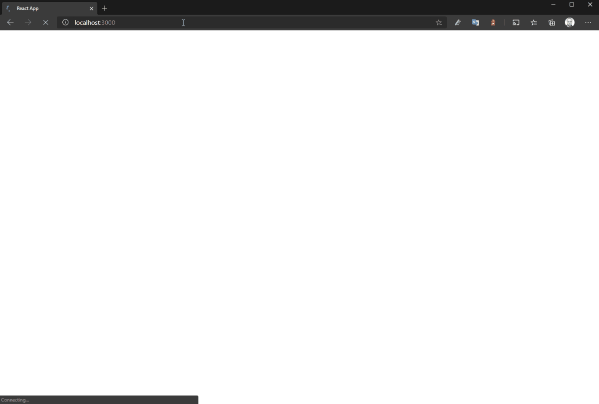

## How to

```console
npm i
npm start
```
## Browsers support

| [](http://godban.github.io/browsers-support-badges/)<br/>IE / Edge | [](http://godban.github.io/browsers-support-badges/)<br/>Firefox | [](http://godban.github.io/browsers-support-badges/)<br/>Chrome | [](http://godban.github.io/browsers-support-badges/)<br/>Opera |
| --------- | --------- | --------- | --------- |
| Edge| last version| last version| last version

## Screenshot



## References
- https://picsum.photos/
- https://www.iconfinder.com/iconsets/slim-square-icons-basics
- https://www.valentinog.com/blog/socket-react/
- https://medium.com/javascript-in-plain-english/how-to-build-a-simple-react-app-with-express-api-b4ab3d16f06d